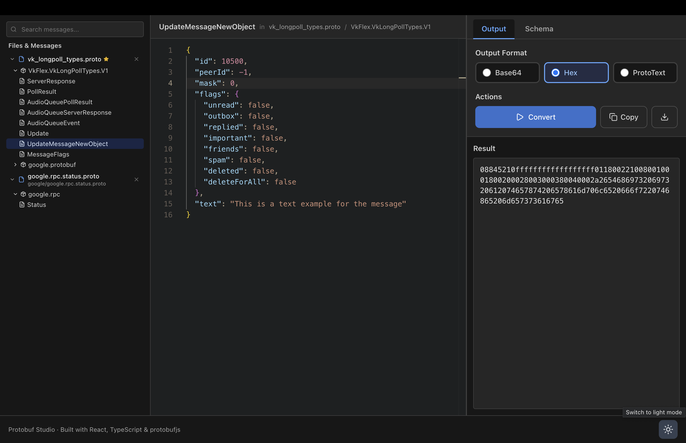

# Protobuf Studio

A powerful web-based tool for working with Protocol Buffer messages. Edit messages as JSON with intelligent autocomplete and convert them to multiple formats (Base64, Hex, ProtoText) with real-time validation.



## Features

### Core Functionality
- **Multi-format Conversion** - Convert JSON to Base64, Hex, or ProtoText formats
- **Monaco Editor Integration** - Full-featured code editor with syntax highlighting and IntelliSense
- **Smart Autocomplete** - Context-aware suggestions for message fields, enums, and nested types
- **Real-time Validation** - Instant feedback on JSON syntax and protobuf schema compliance
- **Type Safety** - Automatic enum normalization and bytes field handling

### File Management
- **Multi-file Support** - Work with complex proto projects spanning multiple files
- **File Tree Navigation** - Hierarchical view of files, packages, and message types
- **Fuzzy Search** - Quickly find messages with keyboard-driven search (Cmd/Ctrl+F)
- **Import Resolution** - Automatic dependency detection and resolution for proto imports
- **File Removal** - Remove individual proto files from memory without losing other work

### User Experience
- **Auto-persistence** - All proto files and JSON content automatically saved to IndexedDB
- **Per-message State** - Each message type remembers its last JSON content
- **Dark Mode** - Full theme support with custom Gruvbox Dark theme
- **Keyboard Shortcuts** - Efficient workflow with hotkeys for common actions
- **100% Local** - All processing happens in the browser, no server or network required

### Output Options
- **Schema Viewer** - Inspect full message definitions with syntax highlighting
- **Copy & Download** - Export converted data to clipboard or files
- **ProtoText Support** - Canonical text format with proper escaping and enum names

## Tech Stack

- **Frontend**: React 19 + TypeScript + Vite
- **Editor**: Monaco Editor (VS Code's editor)
- **Protobuf**: protobufjs for parsing and encoding
- **Styling**: Tailwind CSS
- **Storage**: IndexedDB for local persistence
- **Icons**: Lucide React

## Getting Started

```bash
# Install dependencies
npm install

# Run development server (default: http://localhost:5173)
npm run dev

# Build for production
npm run build

# Preview production build
npm run preview

# Lint code
npm run lint
```

## Usage Guide

### Basic Workflow

1. **Upload Proto Files**
   - Click the upload button or drag-drop `.proto` files
   - Main file will be marked with a star icon
   - Dependencies are automatically detected

2. **Navigate Messages**
   - Browse the file tree on the left sidebar
   - Use Cmd/Ctrl+F to search for specific message types
   - Press Enter/Shift+Enter to cycle through search results

3. **Edit JSON**
   - Select a message type to load its default JSON structure
   - Use autocomplete (triggered automatically or with Ctrl+Space) for field suggestions
   - Validation errors appear in real-time at the bottom of the editor

4. **Convert Data**
   - Choose output format: Base64, Hex, or ProtoText
   - Click "Convert" or press Cmd/Ctrl+Enter
   - View results in the Output tab or inspect the schema in the Schema tab

5. **Export Results**
   - Click "Copy" to copy output to clipboard
   - Click the download button to save as a file
   - Files are named by format (e.g., `output.base64.txt`)

### Keyboard Shortcuts

| Shortcut | Action |
|----------|--------|
| `Cmd/Ctrl + F` | Focus search box |
| `Enter` | Navigate to next search result |
| `Shift + Enter` | Navigate to previous search result |
| `Escape` | Clear search and unfocus |
| `Cmd/Ctrl + Enter` | Convert JSON to selected format |
| `Alt + 1` | Switch to Base64 format |
| `Alt + 2` | Switch to Hex format |
| `Alt + 3` | Switch to ProtoText format |
| `Ctrl + Space` | Trigger autocomplete in editor |

### Advanced Features

#### Enum Handling
The tool automatically converts enum string names to their numeric values during conversion:
```json
// Input: string enum name
{ "status": "ACTIVE" }

// Automatically converted to numeric value for encoding
{ "status": 1 }
```

#### Bytes Fields
Bytes fields accept both plain text and base64-encoded data:
```json
// Plain text (auto-converted to base64)
{ "data": "Hello World" }

// Or use base64 directly
{ "data": "SGVsbG8gV29ybGQ=" }
```

#### Import Resolution
When proto files reference imports that aren't loaded:
1. The Import Resolver panel appears at the bottom
2. Upload the required files when prompted
3. All messages become available once dependencies are resolved

## How It Works

Protobuf Studio runs entirely in your browser:

1. **Parsing**: Uses `protobufjs` to parse `.proto` files and build a type registry
2. **Schema Generation**: Extracts message schemas for Monaco Editor's JSON validation
3. **Autocomplete**: Builds intelligent suggestions from message field definitions
4. **Validation**: Validates JSON against protobuf schemas before encoding
5. **Encoding**: Converts validated JSON to binary protobuf format
6. **Output**: Transforms binary data to requested format (Base64/Hex/ProtoText)
7. **Storage**: Persists all data to IndexedDB for instant recovery on next visit

No data ever leaves your browser - everything is processed locally with no server communication.

## Project Structure

```
src/
├── components/          # React components
│   ├── FileTreeNavigator.tsx   # File/message tree with search
│   ├── JsonEditor.tsx          # Monaco-based JSON editor
│   ├── OutputPanel.tsx         # Output display and format selection
│   ├── MessageDefinition.tsx   # Schema viewer
│   ├── ProtoUploader.tsx       # File upload interface
│   ├── ImportResolver.tsx      # Import dependency resolver
│   └── ThemeToggle.tsx         # Dark/light mode toggle
├── hooks/               # Custom React hooks
│   ├── useProtobuf.ts          # Proto file management & parsing
│   └── useConversion.ts        # Format conversion logic
├── utils/               # Utility functions
│   ├── generateDefaultMessage.ts     # Default JSON generation
│   ├── generateProtoDefinition.ts    # Schema definition formatter
│   ├── messageStateStorage.ts        # IndexedDB operations
│   ├── normalizeEnumValues.ts        # Enum string to number conversion
│   ├── normalizeBytesFields.ts       # Bytes field preprocessing
│   ├── monacoTheme.ts                # Custom editor theme
│   ├── protobufLanguage.ts           # Proto syntax highlighting
│   └── prototextLanguage.ts          # ProtoText syntax highlighting
├── types/               # TypeScript type definitions
└── contexts/            # React contexts (Theme)
```

## Browser Compatibility

Works in all modern browsers with:
- ES2020 support
- IndexedDB support
- Web Workers (for Monaco Editor)

Tested on: Chrome 90+, Firefox 88+, Safari 14+, Edge 90+

## Contributing

Contributions are welcome! This is a local-first tool focused on privacy and developer experience.

## License

MIT
